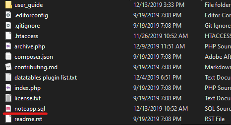

# ci_noteapp
Codeigniter's NoteApp for Taspen

***

This is NoteApp project for digitalized Minutes of Meeting, Taspen Kantor Cabang Madiun.

** This work still in development and not implemented until permission granted.

** This work is developed by Mahardika Inra and supervised by Hani Fajrurrohman.

***

# Let's Get Started

### 1. What you will need?

In this project, you will need:

- Web server development environment (XAMPP, LAMPP, WAMPP, etc.) In this case we use **XAMPP** and you can download [here.](<https://www.apachefriends.org/download.html>) 
- Code editor (Notepad, Notepad++, Sublime Text, VS Code) Choose one that suits you.
- A web browser. *Well, of course the one that you open to browse this repo.*
- Main file in this repository named [noteapp.zip](noteapp.zip) <- Click to redirect to download page

### 2. Setup base file

After all required files downloaded, you need to install all of it. Let the configuration of XAMPP default. After XAMPP installed, extract the zipped file into.

`C:\xampp\htdocs\`

and it should look like:

* *note, the name you extracted is just **noteapp** with no* "ci_"

### 3. Setting Database

* Open Xampp

* Press "Start" on **Apache** and **MySQL** button 

  

* Open Web Browser and type

  `http://localhost/phpmyadmin/`

* Click **New**

  

* Create new database name **noteapp**

  

* After creating the database, click on it and go to **import** tab then press choose file to import the database

  

   

* Done, all being set up, go to the next step

### 4. All Set, go to login page

Now, simply go to

`http://localhost/noteapp/`

and login to your credentials